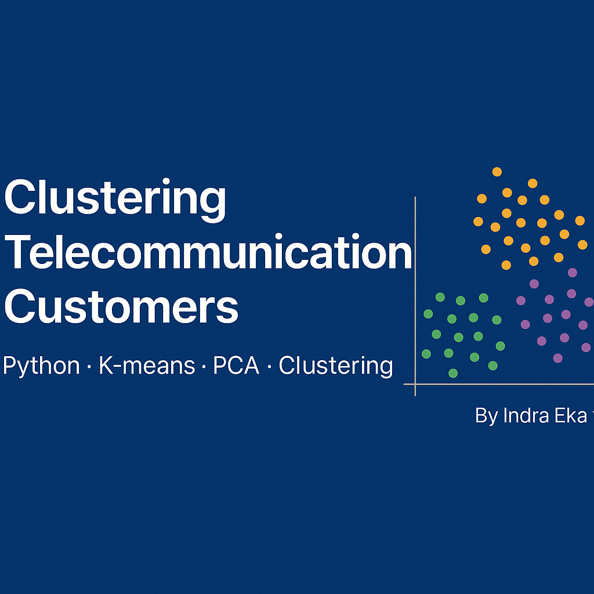

# 📊 Clustering Telecommunication Customers



This project applies **clustering analysis** to telecommunication customer data to discover patterns and segment customers based on their usage, satisfaction, and service attributes.  
The project performs feature engineering, outlier handling, and unsupervised learning using **KMeans** and **PCA**.

---


---

## 🧠 Objective

- Segment telecom customers into distinct groups
- Handle outliers using Winsorization and transformation
- Use **Principal Component Analysis (PCA)** to reduce dimensions
- Evaluate clustering quality using **Silhouette Score**

---

## 📊 Features & Methods

- Boxplot and histogram analysis for EDA
- Label encoding and scaling (MinMaxScaler)
- Outlier handling with `scipy.stats.winsorize`
- `KMeans` clustering
- `PCA` for 2D visualization

---

## 📂 Project Structure

```
ClusteringTelecomunicationCustomer.ipynb
assets/
└── clustering-telecom-banner.png
```

---

## 🧪 Evaluation

- **Silhouette Score**: used to determine optimal number of clusters
- 2D PCA plot to visualize cluster separation

---

## 👨‍💻 Author

**Indra Eka Mandriana S.Kom**  
_Unsupervised Learning & Customer Insight Engineer_

---

## ⭐ Found this insightful? Star it on GitHub and explore the clusters!
